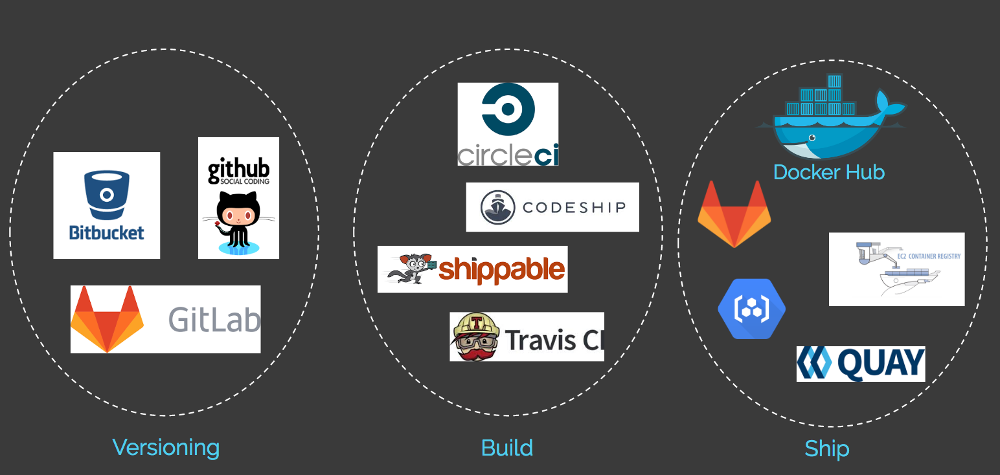
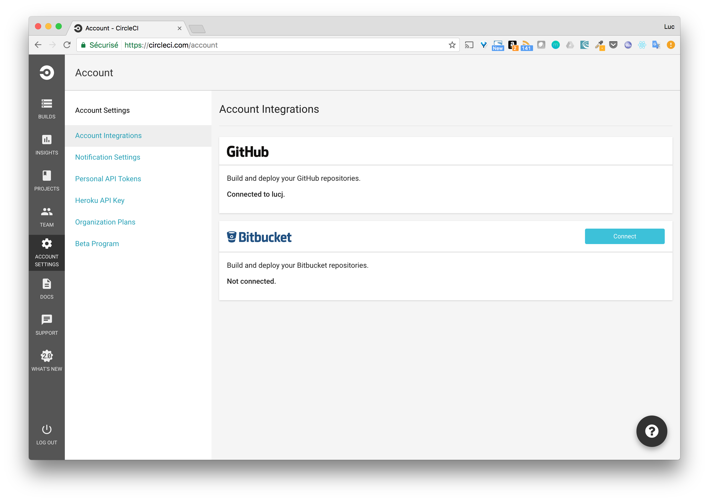
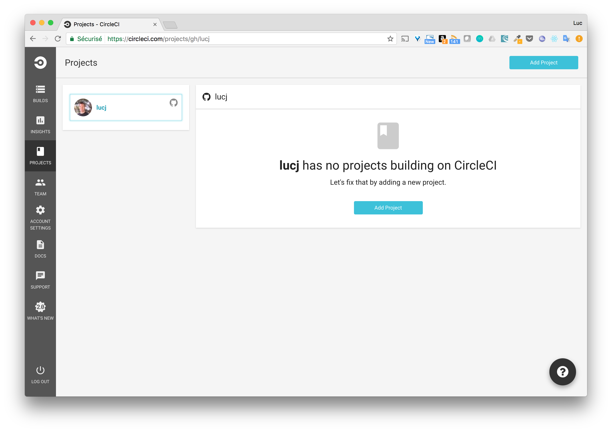
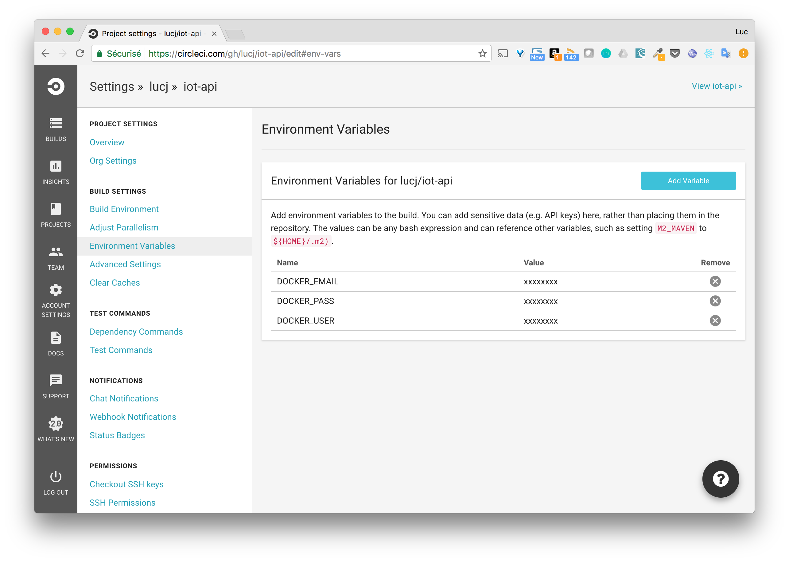
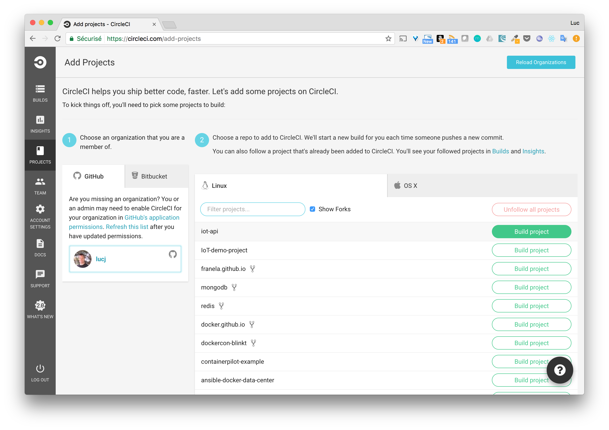
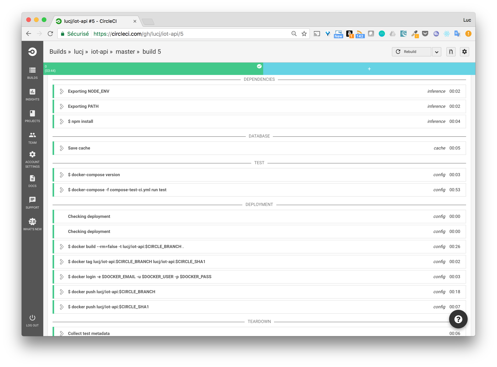
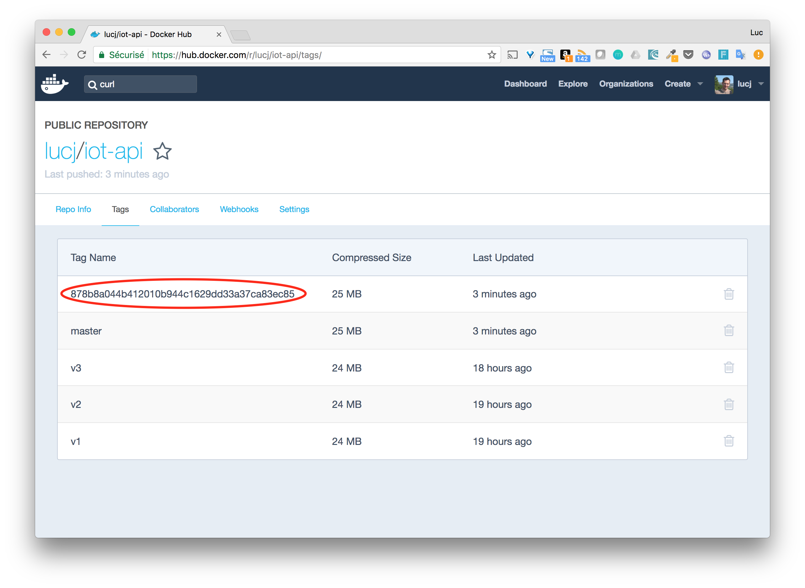

# Objectives

In this step, we will setup a basic CI (Continuous Integration) pipeline.

# Some tools of the CI lanscape

A lot of online services exists for each of the versionning, test and images storage part.

Note: we only consider SaaS platforms here but a lot of tools can be installed on prems as well.

# The workflow

The workflow we will consider is the following one

* code pushed in a repository of our versionning tool
* tests are automatically ran
* image is created and pushed to a registry if tests succeed

Note: 2 tag of the same image will be created, the first one is the name of the branch where the code changes have been done, the second one is the value of the GitHub commit of thoses changes.

Among the tools available we will use the following ones

* GitHub to handle the source code (we already using it though)
* [CircleCI](http://circleci.com) to run the tests, they offer a great free tier btw
* [Docker Hub](https://hub.docker.com) to store the Docker images of the application

# Adding CircleCI in the picture

The main testing platforms are configured in pretty much the same way, and this applies to CircleCI as well

* a link needs to be done with a GitHub account
* a configuration file needs to be created at the root of the GitHub repository that will be tested

Let's review the process in details.

1. We first need to link our GitHub account

CircleCI eases this process as it offers the possibility to signup directly using GitHub.

The GitHub account is then linked to the platform

2. Select the project to be handled in CircleCI

Going into the project section, we can add a new project selecting one of our GitHub repositories. 

Within the project settings, we then set our Docker Hub credentials as environment variables (this second step is need to that CircleCI can push images to the Hub).

3. Add a circle.yml configuration file

When running the tests for a project, CircleCI expects to have a *circle.yml* file at the root of the project (GitHub repository). This file is where all the steps are defined.

Let's have a look at the way tests are done in the [Node.js example implementation](./nodejs/)

4. Build the project

The project is now ready to be built. Clicking on the *build* button will retrieve the source from Github and perform the tests and the associated actions.

5. See all of this into account

Let's now see this simple workflow into action

Commit changes and push it into GitHub

Check that the tests are automatically triggered in CircleCI

Going into Docker Hub we can see the image has been created with both tags
* master as this is the name of the branch on which the changes have been done
* GitHub's COMMIT_ID so the version of the code can be easily matched against the image

