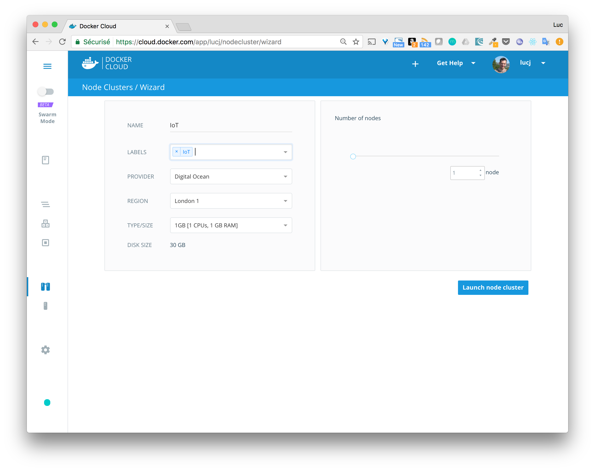
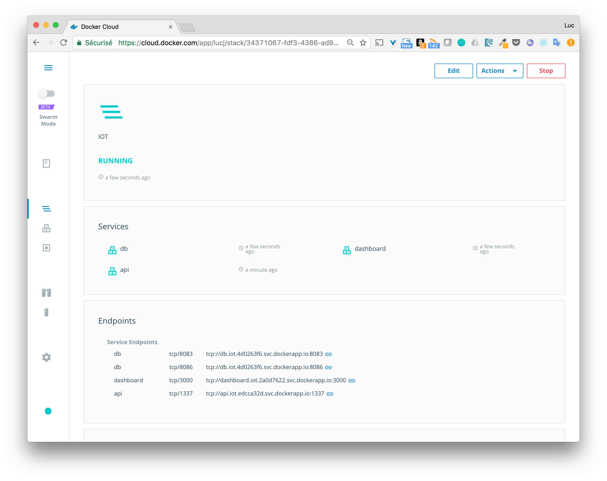
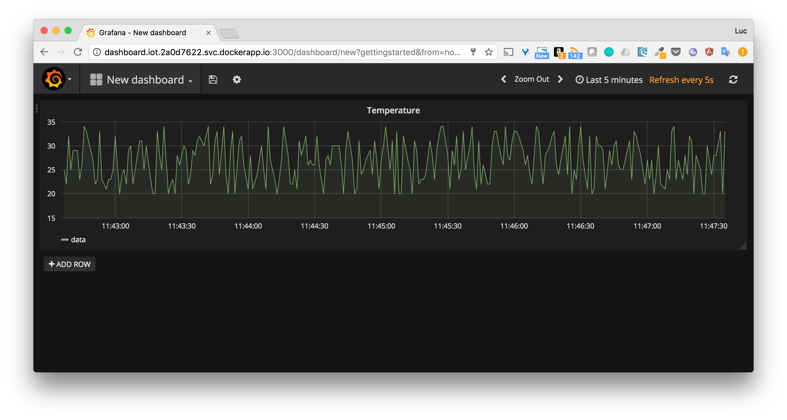
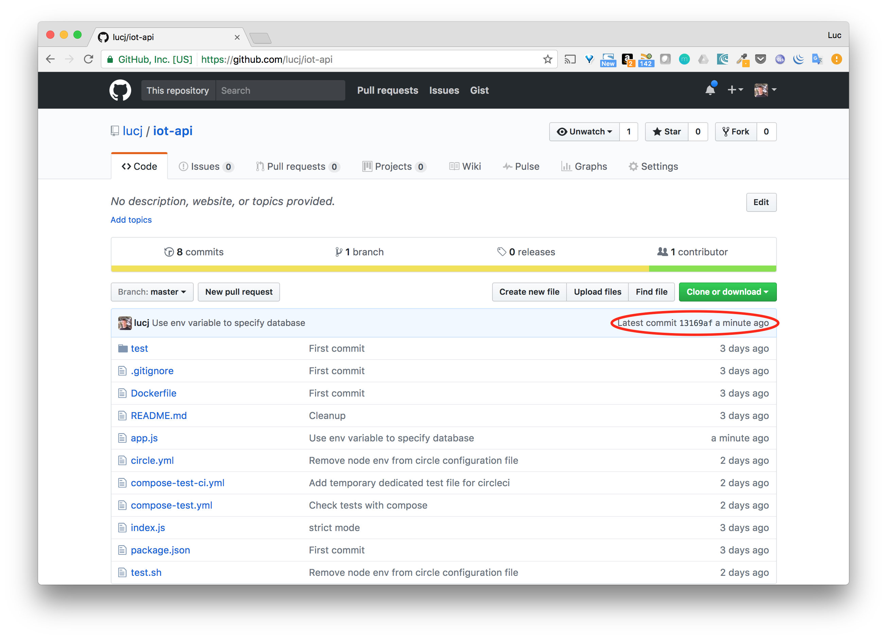
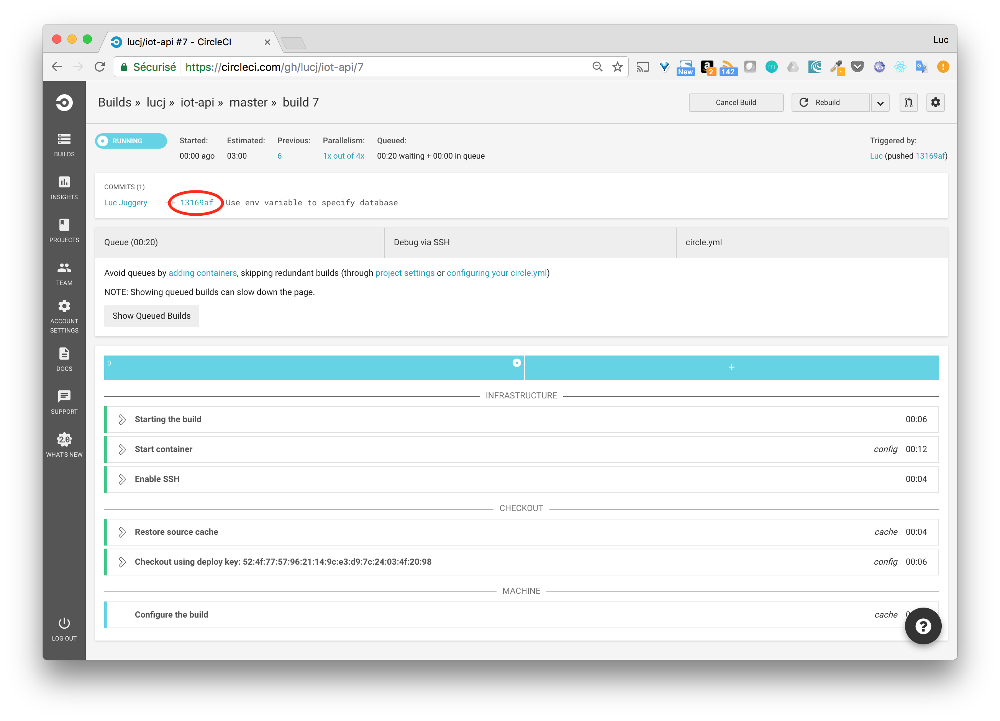
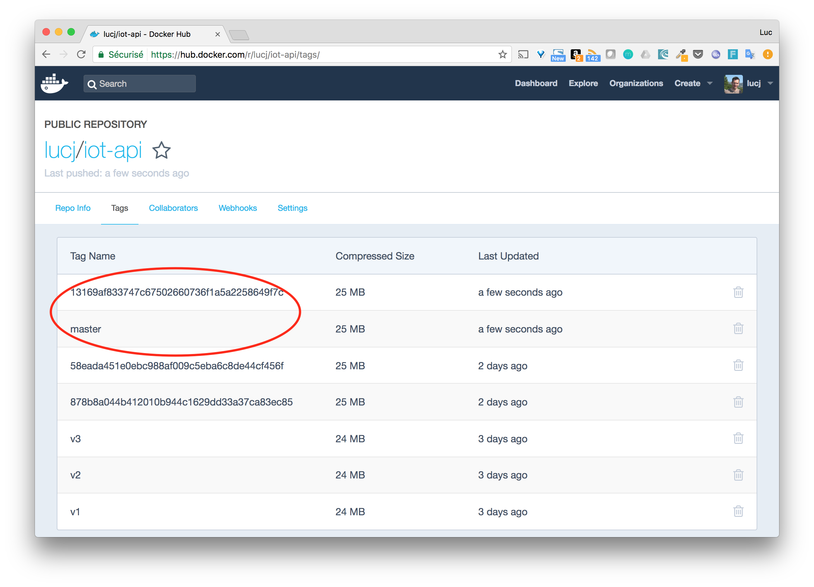
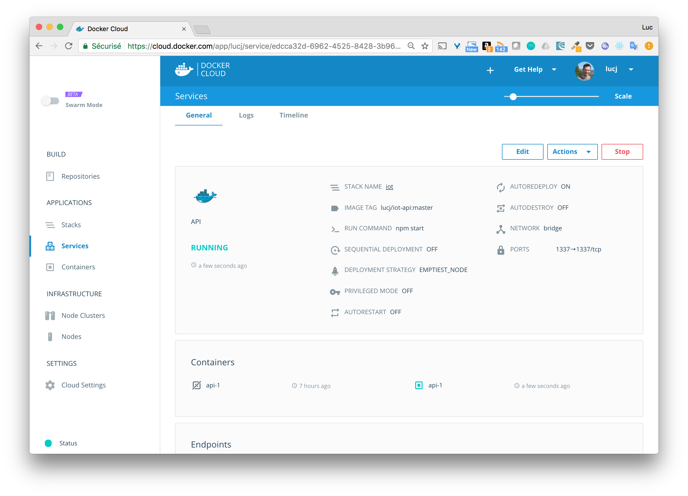

# WARNING

-----
Docker recently announced the discontinuation of DockerCloud on May 21th.

This step will be removed soon and updated with a continuous deployment on a Swarm
-----


# Purpose

Now that we have a simple continuous integration pipeline that create the image of our application, we will go one step further and automatically deploy the new image.

# What we will do

* Introduce Docker Cloud fonctionalities and concepts
* Setup a node
* Create the application stack
* Test the complete CI/CD flow

# Docker Cloud

Basically, [Docker Cloud](https://cloud.docker.com) is the 100% web based solution that enables to manage multi-containers application in an easy way, from the setup of the underlying infrastrucute to the redeployment at the end of the CI/CD pipeline.

The definition in Docker's documentation is the following one:

```
Docker Cloud provides a hosted registry service with build and testing facilities for Dockerized application images; tools to help you set up and manage host infrastructure; and application lifecycle features to automate deploying (and redeploying) services created from images.
```

That is a lot of fonctionnalities and we will now illustrate some of them.

We can log on [Docker Cloud](https://cloud.docker.com) using the Docker Hub credential. 
Once log, the welcome page is the following one.


As we can see there is a lot of features here:
* Image registry
* Application deployment
* CI/CD workflow
* Teams / Users management

In the following we will deploy our 3 containers applications (api, db, dashboard) and before that we will create a node on [DigitalOcean](https://digitalocean.com), from Docker Cloud interface, where the application will run.

# Setup a node

Setting up a node is really easy, the first step is to go into the *Cloud Settings* menu and select a cloud provider (among AWS, DigitalOcean, Microsoft Azure, SoftLayer, Packet). In this example, we use DigitalOcean, if you do not have an account on DigitalOcean (DO), yet, I really recommend you create one and have a try (a couple of bucks will be enough to get started).


When the cloud provider is linked, we can select it when creating a new node, from the Node menu.



Note: depending upon the cloud provider used, the available options will be different though.

After a couple of seconds, the node is created and ready to host our application.

# The application stack

In the previous step we have built the application so it is now a multi-containers app handled by Docker Compose. In the current version of Docker Cloud (that might change in the future), a docker-compose.yml file cannot be used as is (which is a pity I have to admit). But... the positive thing is that it only requires some little changes in the docker-compose.yml file. We created the *docker-cloud.yml* file out of *docker-compose.yml* and this is the file we will use in Docker Cloud.

As we can see, we need to remove the top level keys (version, services, volumes) and that is pretty much all.

In Docker cloud, there is the notion of Stack, which is a set of services, each services being instanciated in one or several containers. Our application will be deployed as a stack by draging the *docker-cloud.yml* file in the interface.


From there, we just need to click on the "Create and Deploy" button and our stack will come to life.



At the bottom of the screenshot, the exposed endPoints are listed, we will use them to access the services. Let's first use the InfluxDB endPoint exposing the administration interface to create the *iot* database.


# Run the simulator

Let's run the simulator using the endPoint exposed by the *api*

````
$ ./simulator.sh -h api.iot.edcca32d.svc.dockerapp.io -p 1337
=> About to send data to api.iot.edcca32d.svc.dockerapp.io on port 1337
````

The simulator seems to be working fine, let's now check if the application is receiving the data.

# Visualize the data

The data are correctly received as we can see from the dashboard.



# Test the CI/CD flow

Let's now make a small change to the code of *iot-api* and push those changes to GitHub.
We will simply enable to pass the database name through the INFLUXDB_DATABASE environment variable and leave the default to "iot".

Let's do this change in our *iot-api* repository and push it to GitHub.

1. Changes pushed to GitHub



2. Test triggered on CircleCI



3. Image pushed on Docker Hub



4. Image redeployed via Docker Cloud



# Summary

In this step we have added the Continuous Deployment in just a couple of steps.

Note: as we can see from the Docker Cloud welcome page, we could have used Docker Cloud for the Continuous Integration as well but I think it's good to see some other services of the ecosystem and CircleCI definitely deserves a look IMHO.

